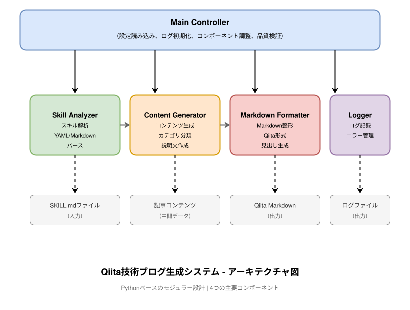

# 設計ドキュメント

## 概要

本システムは、Claude用Agent Skillsリポジトリ内のすべてのスキルを解析し、初学者向けにわかりやすく解説するQiita技術ブログ記事を自動生成するPythonベースのツールです。

skills/ディレクトリ配下の全スキルを走査し、各SKILL.mdファイルからYAMLフロントマターとMarkdown本文を解析します。抽出した情報を5つのカテゴリ（クリエイティブ&デザイン、開発&技術、ドキュメント処理、エンタープライズ&コミュニケーション、メタスキル）に分類し、初学者が理解しやすい日本語の技術記事として出力します。

記事には、Agent Skillsの基本概念、安全性とリスク評価、必要な前提ソフトウェアとエコシステム、各スキルの詳細説明が含まれます。出力はQiita Markdown形式で、そのまま投稿可能な品質を目指します。

## アーキテクチャ

### システム構成

本システムは、以下の4つの主要コンポーネントで構成されます：



**コンポーネント概要:**
- **Main Controller**: 全体の制御、設定読み込み、ログ初期化、品質検証
- **Skill Analyzer**: SKILL.mdファイルの解析、YAML/Markdownパース
- **Content Generator**: コンテンツ生成、カテゴリ分類、説明文作成
- **Markdown Formatter**: Markdown整形、Qiita形式変換、見出し生成
- **Logger**: ログ記録、エラー管理

### データフロー

1. **入力**: skills/ディレクトリ配下のSKILL.mdファイル群
2. **解析**: Skill_AnalyzerがYAMLフロントマターとMarkdown本文を抽出
3. **分類**: スキル名に基づいて5つのカテゴリに自動分類
4. **生成**: Content_Generatorが初学者向けの説明文を生成
5. **整形**: Markdown_FormatterがQiita形式に整形
6. **検証**: Main Controllerが品質基準を満たすか検証
7. **出力**: UTF-8エンコーディングのMarkdownファイル

### 技術スタック

- **言語**: Python 3.8以上
- **YAMLパーサー**: PyYAML
- **Markdownパーサー**: python-markdown
- **ファイルシステム**: pathlib（標準ライブラリ）
- **ロギング**: logging（標準ライブラリ）
- **設定管理**: JSON（標準ライブラリ）

## コンポーネントとインターフェース

### 1. Skill_Analyzer

**責務**: SKILL.mdファイルの読み込みと解析

**インターフェース**:
```python
class SkillAnalyzer:
    def scan_skills_directory(self, skills_path: Path) -> List[Path]:
        """skills/ディレクトリを走査し、SKILL.mdファイルのパスリストを返す"""
        
    def parse_skill_file(self, skill_path: Path) -> Optional[SkillData]:
        """SKILL.mdファイルを解析し、構造化データを返す"""
        
    def extract_yaml_frontmatter(self, content: str) -> Dict[str, Any]:
        """YAMLフロントマターを抽出してパースする"""
        
    def extract_markdown_body(self, content: str) -> str:
        """Markdown本文を抽出する"""
        
    def check_bundled_resources(self, skill_dir: Path) -> Dict[str, bool]:
        """バンドルリソースディレクトリの存在を確認する"""
```

**データモデル**:
```python
@dataclass
class SkillData:
    name: str                    # スキル名（必須）
    description: str             # 説明（必須）
    license: Optional[str]       # ライセンス情報
    directory_path: Path         # スキルディレクトリのパス
    markdown_body: str           # Markdown本文
    has_scripts: bool            # scripts/ディレクトリの有無
    has_references: bool         # references/ディレクトリの有無
    has_assets: bool             # assets/ディレクトリの有無
    has_templates: bool          # templates/ディレクトリの有無
```

**エラーハンドリング**:
- ファイル読み込みエラー: ログに記録してNoneを返す
- YAMLパースエラー: ログに記録してNoneを返す
- 必須フィールド欠如: 警告ログを記録してNoneを返す

### 2. Content_Generator

**責務**: 解析されたスキル情報から記事コンテンツを生成

**インターフェース**:
```python
class ContentGenerator:
    def __init__(self, config: Config):
        self.config = config
        
    def categorize_skills(self, skills: List[SkillData]) -> Dict[str, List[SkillData]]:
        """スキルを5つのカテゴリに分類する"""
        
    def generate_introduction(self) -> str:
        """はじめにセクションを生成"""
        
    def generate_what_is_agent_skills(self) -> str:
        """Agent Skillsとはセクションを生成"""
        
    def generate_safety_section(self) -> str:
        """安全性とリスクセクションを生成"""
        
    def generate_prerequisites_section(self) -> str:
        """前提ソフトウェアセクションを生成"""
        
    def generate_skill_description(self, skill: SkillData) -> str:
        """個別スキルの説明を生成（200-400文字）"""
        
    def generate_conclusion(self) -> str:
        """まとめセクションを生成"""
```

**カテゴリマッピング**:
```python
CATEGORY_MAPPING = {
    "クリエイティブ&デザイン": [
        "algorithmic-art", "canvas-design", "frontend-design", "theme-factory"
    ],
    "開発&技術": [
        "claude-api", "mcp-builder", "webapp-testing", "web-artifacts-builder"
    ],
    "ドキュメント処理": [
        "docx", "pdf", "pptx", "xlsx"
    ],
    "エンタープライズ&コミュニケーション": [
        "brand-guidelines", "doc-coauthoring", "internal-comms", "slack-gif-creator"
    ],
    "メタスキル": [
        "skill-creator"
    ]
}
```

### 3. Markdown_Formatter

**責務**: Qiita形式のMarkdownに整形

**インターフェース**:
```python
class MarkdownFormatter:
    def format_article(self, content_sections: Dict[str, str]) -> str:
        """全セクションを統合してQiita Markdown形式の記事を生成"""
        
    def generate_table_of_contents(self, sections: List[str]) -> str:
        """目次を自動生成"""
        
    def format_heading(self, text: str, level: int) -> str:
        """見出しを初学者向けの表現に整形"""
        
    def format_code_block(self, code: str, language: str) -> str:
        """コードブロックを整形"""
        
    def format_list(self, items: List[str], ordered: bool = False) -> str:
        """リストを整形"""
```

**見出し構造**:
```markdown
# タイトル（H1）
## はじめに（H2）
## Agent Skillsとは（H2）
## Agent Skillsの安全性とリスク（H2）
### 公式Agent Skills（H3）
### ベンダー提供Agent Skills（H3）
### 野良Agent Skills（H3）
### 企業内での安全性判断基準（H3）
### 本記事で扱うAnthropicの公式Agent Skillsについて（H3）
## Agent Skillsを利用・開発するための前提ソフトウェア（H2）
### Agent Skillsを利用できるIDE（H3）
### Agent Skillsを利用できるCLI（H3）
### Agent Skillsを構築するための開発環境（H3）
### パッケージリポジトリとライブラリ管理（H3）
### ドキュメント処理系スキルに必要な外部ツール（H3）
### スキルカテゴリごとの依存関係（H3）
### 企業内利用における考慮事項（H3）
## スキル一覧（H2）
### クリエイティブ&デザイン（H3）
#### algorithmic-art（H4）
#### canvas-design（H4）
...
## まとめ（H2）
```

### 4. Logger

**責務**: 実行ログの記録

**インターフェース**:
```python
class Logger:
    def __init__(self, log_level: str, log_file: Path):
        self.logger = logging.getLogger(__name__)
        
    def log_start(self):
        """処理開始をログに記録"""
        
    def log_skill_processed(self, skill_name: str, status: str):
        """スキル処理状況をログに記録"""
        
    def log_error(self, message: str, exception: Exception = None):
        """エラーをログに記録"""
        
    def log_warning(self, message: str):
        """警告をログに記録"""
        
    def log_end(self, success_count: int, skip_count: int):
        """処理終了をログに記録"""
```

### 5. Main Controller

**責務**: 全体の制御と品質検証

**インターフェース**:
```python
class MainController:
    def __init__(self, config_path: Optional[Path] = None):
        self.config = self.load_config(config_path)
        self.logger = Logger(self.config.log_level, self.config.log_file)
        self.analyzer = SkillAnalyzer()
        self.generator = ContentGenerator(self.config)
        self.formatter = MarkdownFormatter()
        
    def run(self):
        """メイン処理を実行"""
        
    def load_config(self, config_path: Optional[Path]) -> Config:
        """設定ファイルを読み込む"""
        
    def validate_output(self, article: str, skills_count: int) -> bool:
        """出力記事の品質を検証"""
        
    def save_article(self, article: str, output_path: Path):
        """記事をファイルに保存"""
```

**品質検証基準**:
- 記事の文字数が5000文字以上
- すべてのカテゴリが含まれている
- 各スキルの説明が空でない
- Markdown記法の正しさ（見出しレベルの一貫性）
- 安全性セクションの存在
- 前提ソフトウェアセクションの存在
- 見出しの階層構造の適切性

## データモデル

### Config

```python
@dataclass
class Config:
    # 入出力パス
    skills_directory: Path = Path("skills")
    output_directory: Path = Path("output")
    
    # 記事設定
    article_title: str = "Claude Agent Skills完全ガイド：初学者のための実践的スキル解説"
    target_audience: str = "初学者"  # 初学者、中級者、上級者
    max_skill_description_length: int = 400
    
    # カテゴリ設定
    included_categories: List[str] = field(default_factory=lambda: [
        "クリエイティブ&デザイン",
        "開発&技術",
        "ドキュメント処理",
        "エンタープライズ&コミュニケーション",
        "メタスキル"
    ])
    
    # ログ設定
    log_level: str = "INFO"  # DEBUG, INFO, WARNING, ERROR
    log_file: Path = Path("logs/qiita_generator.log")
    
    @classmethod
    def from_json(cls, json_path: Path) -> 'Config':
        """JSONファイルから設定を読み込む"""
        
    @classmethod
    def default(cls) -> 'Config':
        """デフォルト設定を返す"""
```

### ProcessingResult

```python
@dataclass
class ProcessingResult:
    success_count: int
    skip_count: int
    error_count: int
    skipped_skills: List[str]
    error_messages: List[str]
```

## エラーハンドリング

### エラー分類と対応

| エラー種別 | 対応 | ログレベル |
|-----------|------|-----------|
| ファイル読み込みエラー | スキルをスキップして継続 | ERROR |
| YAMLパースエラー | スキルをスキップして継続 | ERROR |
| 必須フィールド欠如 | スキルをスキップして継続 | WARNING |
| 設定ファイル不正 | デフォルト設定を使用 | WARNING |
| 出力ディレクトリ作成失敗 | 処理を中止 | ERROR |
| 全スキル処理失敗 | 処理を中止 | ERROR |
| 品質検証失敗 | 警告を表示して継続 | WARNING |

### エラーメッセージ設計

エラーメッセージには以下を含める：
- 何が起きたか（事象）
- どこで起きたか（ファイルパス、行番号）
- なぜ起きたか（原因）
- どうすればよいか（対処方法）

例：
```
ERROR: SKILL.mdファイルの読み込みに失敗しました
ファイル: skills/example-skill/SKILL.md
原因: ファイルが存在しません
対処: ファイルパスを確認してください
```

## テスト戦略

### テストの種類と範囲

本機能は以下の理由からProperty-Based Testing（PBT）には適していません：

1. **外部ファイルシステムへの依存**: 実際のSKILL.mdファイルを読み込む必要がある
2. **自然言語生成**: 記事コンテンツの生成は決定論的でない
3. **複雑な統合処理**: 複数のコンポーネントが協調して動作する
4. **副作用の存在**: ファイル書き込み、ログ出力などの副作用がある

したがって、以下のテスト戦略を採用します：

### 1. ユニットテスト

各コンポーネントの個別機能をテストします。

**SkillAnalyzer**:
- YAMLフロントマターの正しい抽出
- Markdown本文の正しい抽出
- 必須フィールドの検証
- バンドルリソースの検出
- エラーケースの処理（不正なYAML、欠損フィールド）

**ContentGenerator**:
- スキルの正しいカテゴリ分類
- 説明文の文字数制限
- 各セクションの生成（空でないこと）
- カテゴリマッピングの正確性

**MarkdownFormatter**:
- 見出しレベルの正しい生成
- コードブロックの正しい整形
- リストの正しい整形
- 目次の正しい生成
- Markdown記法の妥当性

**Logger**:
- ログメッセージの正しい記録
- ログレベルの正しい適用
- ログファイルの正しい作成

### 2. 統合テスト

複数のコンポーネントが協調して動作することをテストします。

**テストケース**:
- 実際のskills/ディレクトリを使用した完全な処理フロー
- 設定ファイルからの読み込みと適用
- エラーが発生した場合の継続処理
- 品質検証の実行
- 出力ファイルの生成

### 3. エンドツーエンドテスト

システム全体が期待通りに動作することをテストします。

**テストケース**:
- デフォルト設定での実行
- カスタム設定での実行
- 一部のスキルが不正な場合の処理
- 出力ファイルの内容検証（文字数、セクション存在、Markdown妥当性）

### 4. 手動テスト

自動化が困難な項目を手動でテストします。

**テスト項目**:
- 生成された記事の可読性
- 初学者向けの説明の適切性
- 見出しの理解しやすさ
- Qiitaでの表示確認

### テストデータ

**モックSKILL.mdファイル**:
- 正常なファイル（全フィールド完備）
- 必須フィールド欠如
- 不正なYAML
- 空のファイル
- バンドルリソースあり/なし

**期待される出力**:
- 各テストケースに対する期待される記事構造
- 期待されるログメッセージ
- 期待されるエラーメッセージ

## 実装の詳細

### ファイル構成

```
qiita_skills_blog_generator/
├── __init__.py
├── main.py                    # エントリーポイント
├── config.py                  # Config データクラス
├── skill_analyzer.py          # SkillAnalyzer クラス
├── content_generator.py       # ContentGenerator クラス
├── markdown_formatter.py      # MarkdownFormatter クラス
├── logger.py                  # Logger クラス
├── controller.py              # MainController クラス
├── constants.py               # 定数定義（カテゴリマッピング等）
└── utils.py                   # ユーティリティ関数
```

### 実行方法

```bash
# デフォルト設定で実行
python -m qiita_skills_blog_generator.main

# カスタム設定で実行
python -m qiita_skills_blog_generator.main --config config.json

# ヘルプ表示
python -m qiita_skills_blog_generator.main --help
```

### 設定ファイル例

```json
{
  "skills_directory": "skills",
  "output_directory": "output",
  "article_title": "Claude Agent Skills完全ガイド",
  "target_audience": "初学者",
  "max_skill_description_length": 400,
  "included_categories": [
    "クリエイティブ&デザイン",
    "開発&技術",
    "ドキュメント処理",
    "エンタープライズ&コミュニケーション",
    "メタスキル"
  ],
  "log_level": "INFO",
  "log_file": "logs/qiita_generator.log"
}
```

### 出力ファイル名

```
output/2025-01-XX_claude-agent-skills-guide.md
```

形式: `YYYY-MM-DD_<slug>.md`

### パフォーマンス考慮事項

- **ファイルI/O**: 一度に全ファイルを読み込まず、逐次処理
- **メモリ使用**: 大きなMarkdown本文は必要な部分のみ保持
- **並列処理**: 現時点では不要（スキル数が少ない）
- **キャッシング**: 設定ファイルとカテゴリマッピングをキャッシュ

### セキュリティ考慮事項

- **ファイルパス検証**: パストラバーサル攻撃を防ぐ
- **入力サニタイゼーション**: YAMLインジェクションを防ぐ
- **出力エスケープ**: Markdownインジェクションを防ぐ
- **権限管理**: 読み取り専用でskills/ディレクトリにアクセス

## まとめ

本設計ドキュメントでは、Qiita技術ブログ自動生成システムの全体像を示しました。

**主要な設計判断**:
1. **Pythonの採用**: ファイル処理とテキスト処理に適している
2. **モジュラー設計**: 各コンポーネントが独立して動作し、テストしやすい
3. **エラー継続処理**: 一部のスキルが不正でも処理を継続
4. **品質検証**: 出力記事の品質を自動的に検証
5. **設定のカスタマイズ**: JSONファイルで柔軟に設定可能

**次のステップ**:
1. タスクリストの作成
2. 各コンポーネントの実装
3. ユニットテストの作成
4. 統合テストの実行
5. 実際のskills/ディレクトリでの動作確認
