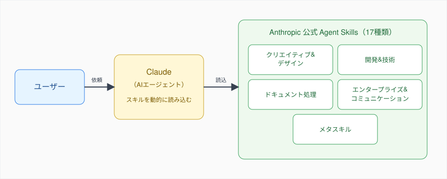
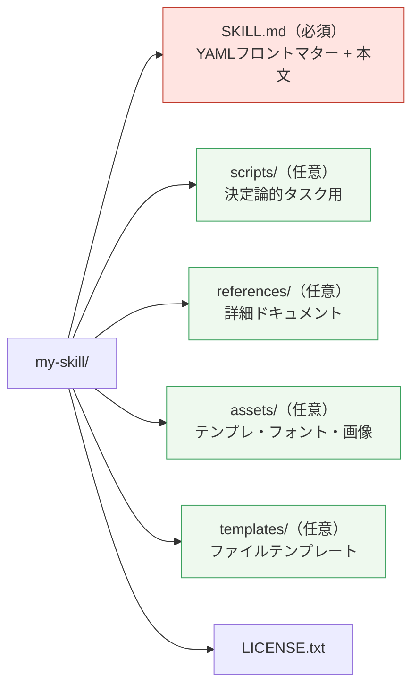
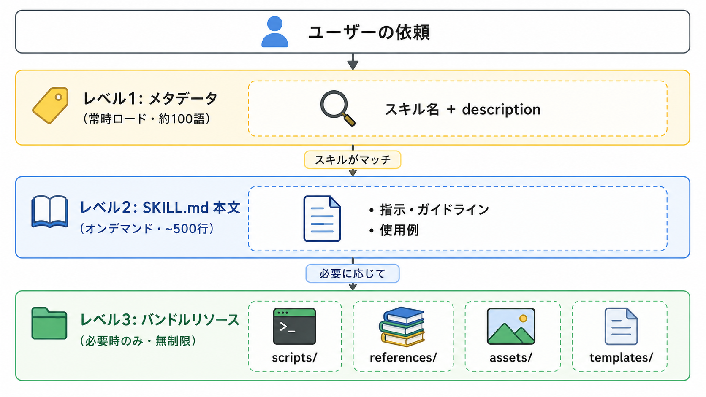
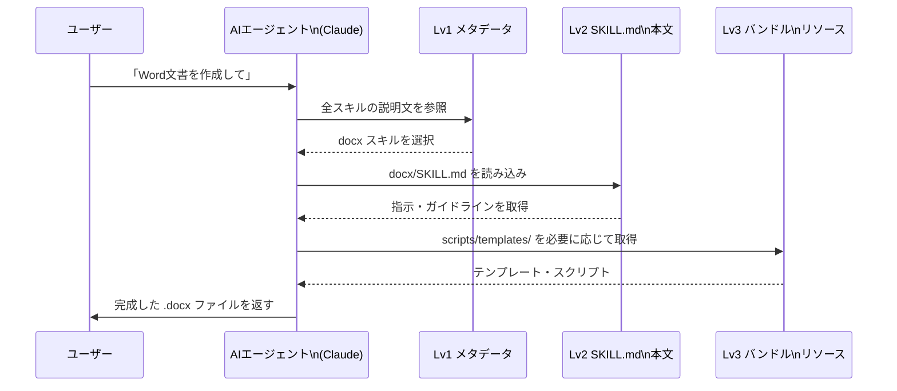
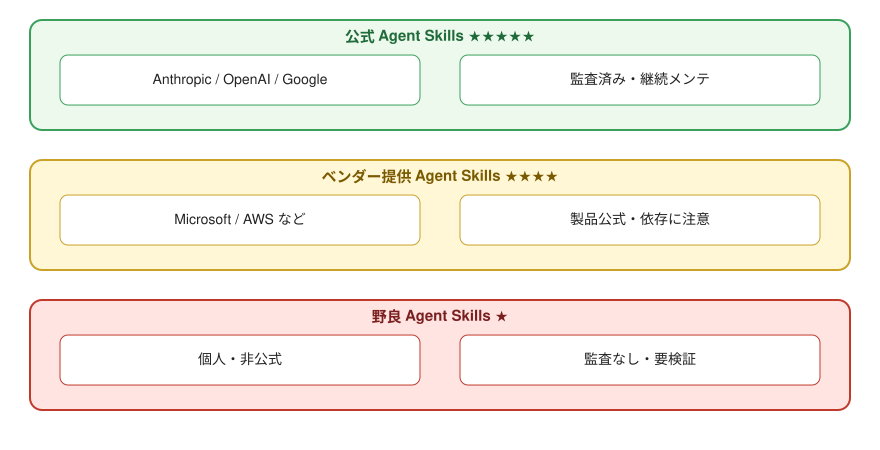
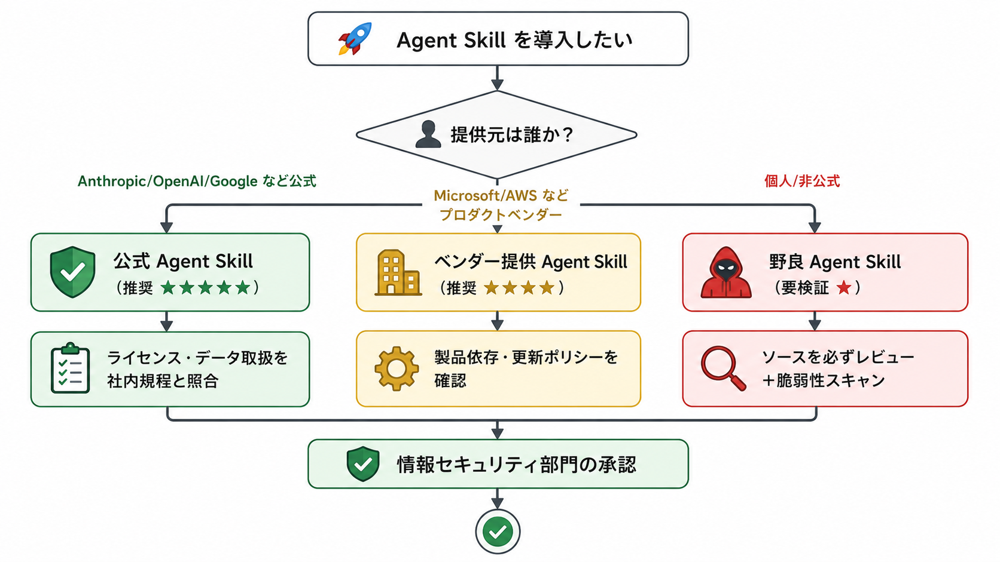

# Claude Agent Skills完全ガイド：初学者のための実践的スキル解説

## 目次

1. [はじめに](#はじめに)
2. [Agent Skillsとは](#agent-skillsとは)
3. [Agent Skillsの歴史と公式ロードマップ](#agent-skillsの歴史と公式ロードマップ)
4. [Agent Skillsの安全性とリスク](#agent-skillsの安全性とリスク)
5. [Agent Skillsを利用・開発するための前提ソフトウェア](#agent-skillsを利用・開発するための前提ソフトウェア)
6. [スキル一覧](#スキル一覧)
7. [まとめ](#まとめ)

## はじめに

AI開発の世界では、大規模言語モデル（LLM）を活用したアプリケーション開発が急速に進化しています。その中でも、**Agent Skills**（エージェントスキル）は、AIエージェントに特定のタスクを効率的に実行させるための重要な仕組みとして注目を集めています。

Agent Skillsは、AIエージェント（Claude Code、OpenAI Codex、Gemini CLIなどのCLI/IDE系開発エージェント）が特定のタスクを実行する際に参照する、指示やスクリプト、リソースをまとめたパッケージです。例えば、「ブランドガイドラインに沿った文書を作成する」「特定のワークフローでデータを分析する」「Word文書やPDFを操作する」といった専門的なタスクを、再現可能な方法で実行できるようにします。

本記事では、**Anthropic社が公開しているClaude用Agent Skills**を初学者向けに解説します。クリエイティブ&デザイン、開発&技術、ドキュメント処理、エンタープライズ&コミュニケーション、メタスキルの5つのカテゴリに分類された全スキルについて、その目的、使用場面、主要な機能を分かりやすく紹介します。

また、企業内でAgent Skillsを利用する際に重要となる**安全性とリスク評価**、そして実際に利用・開発するために必要な**前提ソフトウェアとエコシステム**についても詳しく解説します。これにより、Agent Skillsを安全かつ効果的に活用するための知識を身につけることができます。

**対象読者**: Agent Skillsの概念や使い方を初めて学ぶ方、AIエージェントを活用した開発に興味がある方

## Agent Skillsとは

### Agent Skillsの基本概念

**Agent Skills**（エージェントスキル）は、AIエージェントが特定のタスクを効率的に実行するための「知識パッケージ」です。人間が新しいスキルを学ぶように、AIエージェントも特定の分野やタスクに関する専門知識を必要とします。Agent Skillsは、その専門知識を構造化された形で提供します。

*図: ユーザーの依頼を受けて Claude が必要な Agent Skill を読み込み、出力に反映する全体像。*

具体的には、Agent Skillsは以下の要素で構成されています：

- **SKILL.md**: スキルの中核となるファイル。YAMLフロントマター（メタデータ）とMarkdown本文（指示・ガイドライン）を含みます
- **バンドルリソース**（オプション）:
  - `scripts/`: 決定論的タスク用のPython、JavaScript、シェルスクリプト
  - `references/`: 必要に応じて読み込まれる詳細なドキュメント
  - `assets/`: 出力で使用されるテンプレート、フォント、画像
  - `templates/`: 再利用可能なファイルテンプレート

スキルディレクトリの構造は次のようになります。

*図: スキルのディレクトリ構造。SKILL.mdのみ必須で、他のディレクトリはオプションです。*

### Agent Skillsの仕組み：段階的開示

Agent Skillsは「段階的開示」という効率的な仕組みを採用しています。これは、必要な情報を必要なタイミングで読み込むことで、AIエージェントのコンテキスト（作業メモリ）を効率的に使用する仕組みです。

各レベルの位置づけは次のとおりです。

| レベル | 名称 | 読み込みタイミング | サイズ目安 | 含まれる内容 |
|---|---|---|---|---|
| 1 | メタデータ | 常時コンテキスト内 | 約100語 | スキル名、`description`、いつ使うかの判断材料 |
| 2 | SKILL.md 本文 | スキルがトリガーされた時 | 理想は500行未満 | 詳細な指示・ガイドライン、使用例、ベストプラクティス |
| 3 | バンドルリソース | 必要に応じて | 無制限 | 大規模なリファレンス、スクリプト、テンプレート、アセット |

*図: Agent Skillsの段階的開示（Progressive Disclosure）。AIエージェントは必要な情報だけを段階的に読み込みます。*

この段階的なアプローチにより、AIエージェントは必要な情報だけを効率的に利用できます。

### Agent Skillsの利用方法

Agent Skillsは、以下の環境で利用できます：

| 利用環境 | 提供形態 | 補足 |
|---|---|---|
| Claude.ai | 全プラン（Free / Pro / Max / Team / Enterprise）で利用可能（Code Execution有効化が前提） | UIから自動でスキルが選ばれる |
| Claude Code | プラグインマーケットプレイス経由でインストール | `/plugin install <skill>@anthropic-agent-skills` |
| Claude API | Skills API 経由でプログラムから利用 | カスタムスキルのアップロードも可能 |

スキルを利用する際は、AIエージェントが自動的に適切なスキルを選択して読み込みます。ユーザーは特別な操作をする必要はありません。例えば、「Word文書を作成して」と依頼すると、AIエージェントは自動的に`docx`スキルを読み込み、適切な形式で文書を生成します。

具体的なやり取りは次のシーケンスのように進みます。

*図: ユーザーの依頼からAgent Skillが選ばれて実行されるまでの流れ。*

### Agent Skillsの利点

Agent Skillsを使用することで、以下のような利点が得られます。

| 利点 | 内容 |
|---|---|
| 再現性 | 同じタスクを一貫した品質で実行できる |
| 専門性 | 特定分野の深い知識を活用できる |
| 効率性 | 段階的開示により、必要な情報だけを効率的に利用できる |
| 拡張性 | 新しいスキルを追加することで、AIエージェントの能力を拡張できる |
| 標準化 | 組織内で共通のワークフローやガイドラインを適用できる |

## Agent Skillsの歴史と公式ロードマップ

Agent Skillsは段階的に展開されてきた仕組みで、概念の発表とオープン標準化に大きな節目があります。歴史を押さえておくと、エコシステムの広がりや今後の方向性が理解しやすくなります。

### 主要な節目

| 時期 | 出来事 | 概要 |
|---|---|---|
| 2025年10月16日（米国時間） | Anthropicが**Agent Skills**をClaude向け機能として初公開 | 「指示・スクリプト・リソースをAIエージェントが必要に応じて段階的に読み込む」という**Progressive Disclosure（段階的開示）**を中核設計とする概念を提唱 |
| 2025年10月16日前後 | 公式GitHubリポジトリ [`anthropics/skills`](https://github.com/anthropics/skills) を公開 | `docx` / `xlsx` / `pdf` / `pptx` / `skill-creator` / `mcp-builder` / `frontend-design` などの推奨スキル群を提供開始。ドキュメント系4スキル（`docx`/`xlsx`/`pdf`/`pptx`）はClaude.aiのドキュメント作成機能の基盤として組み込まれた |
| 2025年12月18日 | Agent Skillsを**オープン標準（open standard）**として公開 | 同時にAgent Skillsディレクトリの初期パートナーとしてAtlassian、Canva、Cloudflare、Figma、Notion、Ramp、Sentryの7社のパートナー製スキルを提供開始（Zapier、Stripe等はMCPベースのConnectorsディレクトリ側のパートナー） |
| 2026年4月7日時点 | 公式リポジトリは17スキル体制に拡大 | 本記事で扱うのもこの17スキル |

### Progressive Disclosureが解決する問題

Anthropicが当初から強調しているのは、AIエージェントの**コンテキスト効率**の問題です。すべての専門知識を常時ロードするとコンテキストが飽和してしまうため、メタデータ → 本文 → リソースの3段階で読み込む設計が採用されました（詳細は次の「Agent Skillsとは」セクションで解説）。

### オープン標準化の意義

2025年12月18日のオープン標準化により、AnthropicはAgent Skillsを**自社プロダクトだけの仕組みから、複数のAIプラットフォームで使える共通仕様へ**広げる方針を明確にしました。これにより、企業はAgent Skillsを「Claudeに特化した投資」ではなく「より長期的な再利用可能資産」として位置づけやすくなっています。

### 主な出典

- [Equipping agents for the real world with Agent Skills（Anthropic Engineering Blog）](https://www.anthropic.com/engineering/equipping-agents-for-the-real-world-with-agent-skills)
- [Agent Skills（Claude API Docs）](https://platform.claude.com/docs/en/agents-and-tools/agent-skills/overview)
- [`anthropics/skills`（公式GitHubリポジトリ）](https://github.com/anthropics/skills)
- [Anthropic launches enterprise 'Agent Skills' and opens the standard（VentureBeat）](https://venturebeat.com/technology/anthropic-launches-enterprise-agent-skills-and-opens-the-standard)
- [Agent Skills: Anthropic's Next Bid to Define AI Standards（The New Stack）](https://thenewstack.io/agent-skills-anthropics-next-bid-to-define-ai-standards/)
- [Anthropic publishes Agent Skills as an open standard（The Decoder）](https://the-decoder.com/anthropic-publishes-agent-skills-as-an-open-standard-for-ai-platforms/)
- [Anthropic makes agent Skills an open standard（SiliconANGLE、2025/12/18）](https://siliconangle.com/2025/12/18/anthropic-makes-agent-skills-open-standard/)
- [Anthropic Official Skills Repository: 17 Skills Walkthrough（claudecn.com）](https://claudecn.com/en/blog/claude-official-skills-walkthrough/)

## Agent Skillsの安全性とリスク

企業内でAgent Skillsを利用する際には、安全性とリスクを適切に評価することが重要です。Agent Skillsは、その提供元や開発プロセスによって信頼性が大きく異なります。ここでは、Agent Skillsを3つのカテゴリに分類し、それぞれの特徴と安全性について解説します。

*図: Agent Skillsの提供元による信頼性の比較。本記事で扱うAnthropic公式は最も推奨度が高い区分です。*

### 公式Agent Skills

**公式Agent Skills**とは、Anthropic、OpenAI、Googleなどの大手AI企業（ビッグテック）が自社で開発・公開・メンテナンスしているAgent Skillsです。

**安全性の特徴**:

- **厳格なコードレビューとセキュリティ監査**: 企業内の専門チームによる多層的なレビュープロセスを経ています
- **明確なライセンスと法的保護**: Apache 2.0などのオープンソースライセンス、またはプロプライエタリライセンスで明確に保護されています
- **継続的なメンテナンスとサポート**: バグ修正、セキュリティパッチ、機能改善が定期的に提供されます
- **データプライバシーとセキュリティ**: 企業のプライバシーポリシーとセキュリティ基準に準拠しています
- **悪意のあるコード混入のリスクが極めて低い**: 開発プロセスの透明性と企業の評判により、悪意のあるコードが混入する可能性は極めて低いです

**企業内利用における推奨度**: ★★★★★（最も推奨）

### ベンダー提供Agent Skills

**ベンダー提供Agent Skills**とは、Microsoft、MySQL、AWS、Salesforceなどのプロダクトベンダーが、自社製品やサービスとの統合を目的として開発・公開しているAgent Skillsです。

**安全性の特徴**:

- **製品ベンダーによる品質保証**: 自社製品との互換性と品質が保証されています
- **公式ドキュメントとサポート**: 製品の公式ドキュメントやサポートチャネルが利用できます
- **製品のライフサイクルに連動**: 製品のアップデートに合わせてスキルも更新されます
- **セキュリティ基準の遵守**: ベンダーのセキュリティポリシーに準拠しています
- **特定製品への依存**: そのベンダーの製品やサービスを使用していることが前提となります

**企業内利用における推奨度**: ★★★★☆（推奨、ただし製品依存に注意）

### 野良Agent Skills

**野良Agent Skills**とは、インターネット上で個人や非公式な組織が公開しているAgent Skillsです。GitHubなどのプラットフォームで公開されていますが、出所や品質が不明確な場合があります。

**リスクと注意点**:

- **コードレビューの不在**: 専門的なセキュリティ監査を受けていない可能性があります
- **メンテナンスの不確実性**: 開発者が突然メンテナンスを停止する可能性があります
- **悪意のあるコードのリスク**: 意図的または非意図的に、セキュリティ上の脆弱性や悪意のあるコードが含まれる可能性があります
- **ライセンスの不明確さ**: ライセンス条項が不明確または存在しない場合があります
- **データ漏洩のリスク**: 外部サーバーへのデータ送信など、意図しないデータ漏洩のリスクがあります
- **サポートの欠如**: 問題が発生しても、サポートを受けられない可能性があります

**企業内利用における推奨度**: ★☆☆☆☆（非推奨、使用する場合は徹底的な検証が必要）

### 企業内での安全性判断基準

企業内でAgent Skillsを利用する際は、以下の基準で安全性を評価することを推奨します。

| # | 評価軸 | 確認すべき問い |
|---|---|---|
| 1 | 提供元の信頼性 | 提供元は信頼できる企業または組織か？評判やトラックレコードはどうか？ |
| 2 | コードの透明性 | ソースコードは公開されているか？コードレビューやセキュリティ監査を受けているか？ |
| 3 | ライセンスの明確性 | ライセンス条項が明示されているか？企業内利用が許可されているか？ |
| 4 | メンテナンス体制 | 定期的にアップデートされているか？セキュリティパッチが迅速に提供されているか？ |
| 5 | データの取り扱い | 外部サーバーへのデータ送信があるか？データプライバシーポリシーは明確か？ |
| 6 | 依存関係 | 使用している外部ライブラリやツールは安全か？既知の脆弱性はないか？ |
| 7 | 社内ポリシー整合性 | 自社のセキュリティポリシーに準拠しているか？情報セキュリティ部門の承認は取得済みか？ |

*図: 企業内でAgent Skillを採用する際の安全性判断フロー。*

1. **提供元の信頼性**:
   - 提供元は信頼できる企業または組織か？
   - 提供元の評判やトラックレコードはどうか？

2. **コードの透明性**:
   - ソースコードが公開されているか？
   - コードレビューやセキュリティ監査を受けているか？

3. **ライセンスの明確性**:
   - ライセンス条項が明確に記載されているか？
   - 企業内利用が許可されているか？

4. **メンテナンス体制**:
   - 定期的にアップデートされているか？
   - セキュリティパッチが迅速に提供されているか？

5. **データの取り扱い**:
   - 外部サーバーへのデータ送信はあるか？
   - データプライバシーポリシーは明確か？

6. **依存関係の確認**:
   - 使用している外部ライブラリやツールは安全か？
   - 依存関係に既知の脆弱性はないか？

7. **社内セキュリティポリシーとの整合性**:
   - 自社のセキュリティポリシーに準拠しているか？
   - 情報セキュリティ部門の承認を得ているか？

### 本記事で扱うAnthropicの公式Agent Skillsについて

本記事で解説するAgent Skillsは、すべて**Anthropic社が開発・公開している公式Agent Skills**です。これらのスキルは以下の理由から信頼できます：

**信頼できる理由**:

1. **Anthropic社の開発**: Claude（大規模言語モデル）を開発したAnthropic社が、自社製品の機能を最大限に活用するために設計・開発しています

2. **厳格な品質管理**: Anthropic社内の専門チームによる多層的なコードレビュー、セキュリティ監査、品質保証プロセスを経ています

3. **オープンソースとプロプライエタリの明確な区別**:
   - ほとんどのサンプルスキル: Apache 2.0ライセンス（オープンソース）
   - ドキュメントスキル（docx、pdf、pptx、xlsx）: ソース公開、プロプライエタリライセンス（参照・学習用）

4. **継続的なメンテナンス**: Anthropic社が継続的にメンテナンスし、Claudeの新機能やアップデートに合わせて改善しています

5. **公式ドキュメントとサポート**: 公式ドキュメント、サンプルコード、コミュニティサポートが充実しています

6. **透明性**: ソースコードがGitHub上で公開されており、誰でも内容を確認できます（プロプライエタリスキルも参照可能）

7. **企業利用を想定した設計**: エンタープライズ環境での利用を想定し、セキュリティとプライバシーに配慮した設計になっています

**企業内利用における推奨度**: ★★★★★（最も推奨）

本記事では、これらの信頼性の高い公式Agent Skillsを安心して学習・利用していただけます。ただし、実際に企業内で利用する際は、必ず自社のセキュリティポリシーに照らし合わせて評価し、情報セキュリティ部門の承認を得ることを推奨します。

## Agent Skillsを利用・開発するための前提ソフトウェア

Agent Skillsを効果的に利用・開発するためには、適切なソフトウェア環境が必要です。このセクションでは、Agent Skillsを利用できるツール、開発に必要な環境、そして企業内で利用する際の考慮事項について解説します。

### Agent Skillsを利用できるIDE（統合開発環境）

| IDE | 提供元 | Agent Skills対応 | 企業内利用上の留意点 | 公式サイト |
|---|---|---|---|---|
| VSCode（Visual Studio Code） | Microsoft（公式） | 拡張機能経由でClaude APIと連携 | 無料。Claude API接続のためのインターネットアクセスが必要 | https://code.visualstudio.com/ |
| Kiro | AWS（Amazon Web Services） | Agent Skillsをネイティブにサポート | Amazon Bedrock経由でClaude等のモデルを呼び出す。AWSアカウントが必要 | https://kiro.dev/ |
| Cursor | Anysphere | Claude統合により利用可能 | 商用利用は要ライセンス確認 | https://www.cursor.com/ |
| JetBrains IDEs（IntelliJ IDEA / PyCharm 等） | JetBrains | プラグイン経由でClaude APIと連携 | 商用利用は要ライセンス | https://www.jetbrains.com/ |

### Agent Skillsを利用できるCLI（コマンドラインインターフェース）

| CLI | 提供元 | Agent Skills対応 | 必要なAPIキー |
|---|---|---|---|
| Claude Code | Anthropic（公式） | プラグインマーケットプレイス経由でインストール | Anthropic APIキー |
| Codex | OpenAI（公式） | Anthropic発のAgent Skillsオープン標準（agentskills.io）に準拠 | OpenAI APIキー |
| Gemini CLI | Google（公式） | Anthropic発のAgent Skillsオープン標準（agentskills.io）に準拠 | Google Cloud APIキー |
| Kiro CLI | AWS（Amazon Web Services） | Agent Skillsをネイティブサポート | AWSアカウント（Bedrock経由）。モデル設定によってはAnthropic APIキー |

### Agent Skillsを構築するための開発環境

| ランタイム | 用途 | 推奨バージョン | 主な依存 | 公式サイト |
|---|---|---|---|---|
| Node.js | JS/TSベースのスキルやMCPサーバー開発 | 18 以上（LTS推奨） | npm | https://nodejs.org/ |
| Python | Pythonベースのスキル、ドキュメント処理スクリプト | 3.8 以上 | pip / uv | https://www.python.org/ |
| TypeScript | MCPサーバー開発（推奨言語） | 5.x 以上 | MCP SDK、Zod | https://www.typescriptlang.org/ |

### パッケージリポジトリとライブラリ管理

| リポジトリ / ツール | 用途 | 主な関連パッケージ | 企業内利用上の留意点 |
|---|---|---|---|
| npm | JS/TSライブラリ管理 | `docx`、`@modelcontextprotocol/sdk`、`zod` | `.npmrc` でプロキシ設定可。プライベートレジストリ（Verdaccio、Artifactory）対応 |
| PyPI | Pythonライブラリ管理 | `python-docx`、`fastmcp`、`pydantic` | `pip.conf` でプロキシ設定可。devpi、Artifactory対応 |
| uv | 高速Pythonパッケージマネージャ（pip互換） | （pip互換） | pipと同じプロキシ設定が利用可能 |

### ドキュメント処理系スキルに必要な外部ツール

| ツール | 用途 | 起動コマンド例 | ライセンス | 公式サイト |
|---|---|---|---|---|
| LibreOffice | ドキュメント形式変換、PDF生成 | `soffice --headless --convert-to docx FILE` | Mozilla Public License 2.0 | https://www.libreoffice.org/ |
| Pandoc | 文書変換とテキスト抽出 | `pandoc --track-changes=all FILE.docx -o OUT.md` | GPL v2 以上 | https://pandoc.org/ |
| Poppler | PDFユーティリティ | `pdftoppm INPUT.pdf OUT` | GPL v2 以上 | https://poppler.freedesktop.org/ |
| p5.js | クリエイティブコーディング | CDN経由（`<script src="...p5.js">`） | LGPL v2.1 | https://p5js.org/ |

### スキルカテゴリごとの依存関係

| # | カテゴリ | スキル | 主な依存 |
|---|---|---|---|
| 1 | クリエイティブ&デザイン | algorithmic-art | p5.js（CDN）、Webブラウザ |
| 2 | クリエイティブ&デザイン | canvas-design | Node.js、Canvas API、カスタムフォント |
| 3 | クリエイティブ&デザイン | frontend-design | HTML / CSS / JavaScript、Webブラウザ |
| 4 | クリエイティブ&デザイン | theme-factory | Node.js、CSS処理ライブラリ |
| 5 | 開発&技術 | claude-api | Claude API（Python SDK / TypeScript SDK / cURL） |
| 6 | 開発&技術 | mcp-builder | Node.js + TypeScript + MCP SDK + Zod、または Python + FastMCP + Pydantic |
| 7 | 開発&技術 | webapp-testing | テストフレームワーク（Jest、Pytest 等） |
| 8 | 開発&技術 | web-artifacts-builder | HTML / CSS / JavaScript、Webブラウザ |
| 9 | ドキュメント処理 | docx | Python（python-docx）、Pandoc、LibreOffice（soffice） |
| 10 | ドキュメント処理 | pdf | Poppler（pdftoppm）、Python（PyPDF2 等） |
| 11 | ドキュメント処理 | pptx | Python（python-pptx）、LibreOffice |
| 12 | ドキュメント処理 | xlsx | Python（openpyxl、pandas 等）、LibreOffice |
| 13 | エンタープライズ&コミュニケーション | brand-guidelines | 特別な依存なし（Markdownベース） |
| 14 | エンタープライズ&コミュニケーション | doc-coauthoring | ドキュメント処理ツール（docx、pdf 等） |
| 15 | エンタープライズ&コミュニケーション | internal-comms | 特別な依存なし（テンプレートベース） |
| 16 | エンタープライズ&コミュニケーション | slack-gif-creator | Slack API、画像処理ライブラリ |
| 17 | メタスキル | skill-creator | 特別な依存なし（Markdownベース） |

### 企業内利用における考慮事項

| # | 観点 | 主な内容 |
|---|---|---|
| 1 | ネットワークとセキュリティ | Claude APIへのインターネットアクセス、ファイアウォール / プロキシ設定、CDN経由ライブラリのアクセス可否を事前確認 |
| 2 | プライベートリポジトリの利用 | Verdaccio / JFrog Artifactory / GitHub Packages、devpi など、社内専用のnpm / PyPIサーバーを構築 |
| 3 | ライセンスコストとコンプライアンス | LibreOffice / Pandoc / Poppler / Node.js / Python は無料。Claude APIは従量課金。各ツールのライセンス条項を要確認 |
| 4 | オフライン環境での利用 | 開発ツール本体はオフラインインストール可能。Claude APIはオフライン不可 |
| 5 | データプライバシーとセキュリティ | 入力データはClaude APIに送信される。Anthropicはユーザーデータを学習に使用しないことを明言 |
| 6 | 情報セキュリティ部門の承認 | 導入前に必ず承認を取得。本記事「Agent Skillsの安全性とリスク」のチェック項目を活用 |
| 7 | サポートとメンテナンス | Anthropic公式は継続メンテあり。OSSはコミュニティサポート。Claude API企業向けプランは専任サポートあり |

## スキル一覧

### ライセンスについて

本記事で紹介するAnthropic公式Agent Skillsは、以下の2種類のライセンスモデルで提供されています。各スキルの説明にも、それぞれのライセンス種別を併記しています。

- **Apache 2.0（オープンソース）**: ほとんどのサンプルスキルが対象です。商用・改変・再配布が可能で、企業内での利用にも適しています。各スキルディレクトリの`LICENSE.txt`に正式な条文が含まれています。
- **プロプライエタリ（ソース公開だが参照・学習用）**: ドキュメントスキル（`docx`、`pdf`、`pptx`、`xlsx`）が対象です。Anthropicのドキュメント機能を支える本番品質のスキルパターンを学べるようにソースコードは公開されていますが、Apache 2.0のようなオープンソースライセンスではありません。再配布や商用利用には各スキルの`LICENSE.txt`に記載された条件を必ず確認してください。

なお、`SKILL.md`の`license`フィールドが`"Complete terms in LICENSE.txt"`のように汎用的な記述になっているスキルでも、実際の`LICENSE.txt`はApache 2.0です。一方、ドキュメントスキルは`license`フィールドに`"Proprietary. LICENSE.txt has complete terms"`と明示されています。

#### ドキュメントスキル（`docx` / `pdf` / `pptx` / `xlsx`）の企業内・商用利用について

ドキュメントスキルの`LICENSE.txt`はAnthropicが`© 2025 Anthropic, PBC. All rights reserved.`として権利を留保しており、利用条件はユーザーがAnthropicと結ぶ「Agreement」（個別契約、または[Consumer Terms of Service](https://www.anthropic.com/legal/consumer-terms) / [Commercial Terms of Service](https://www.anthropic.com/legal/commercial-terms)のいずれか該当する方）に従います。要点を整理すると次のとおりです。

| # | 観点 | 結論 | 根拠（`LICENSE.txt`より要約） |
|---|---|---|---|
| 1 | 企業内での商用利用 | **可能**（条件付き） | Anthropicの**Commercial Terms of Service**または個別契約の範囲内であれば、企業として業務目的に利用できる |
| 2 | 利用形態 | **Anthropic自身が提供するサービス上での利用が前提** | Claude.ai / Claude API / Claude Code 等、Anthropicが提供する「Services」を介して使うことを基本とする。Microsoft Foundry / Kiro / Amazon Bedrockなど第三者経由の場合は別途扱いを要確認（後述） |
| 3 | サービス外へのコピー保持 | **禁止** | サービス外にスキルを抽出・保管しないこと（テンポラリの自動コピーは除く） |
| 4 | 派生物の作成 | **禁止** | スキルをベースにした派生物を作成してはならない |
| 5 | 第三者への再配布・サブライセンス | **禁止** | 第三者への配布・サブライセンス・譲渡は不可 |
| 6 | リバースエンジニアリング | **禁止** | デコンパイル・ディスアセンブル等は不可 |
| 7 | 含まれる発明の商品化 | **禁止** | スキル内の発明を製造・販売・輸入することはできない |

**つまり**「Claude.ai / Claude API / Claude Code 上でスキルを呼び出して業務文書（docx・pdf・pptx・xlsx）を生成する」ような通常の利用であれば、Anthropicとの契約条件下で**企業として商用利用可能**です。一方、スキルそのものを社内のローカル環境にコピーして改変したり、自社製品に組み込んで再配布したりすることは**契約違反になる**ため避けてください。

##### サードパーティ経由（Kiro / Microsoft Foundry / Amazon Bedrock 等）での利用について

ドキュメントスキルの`LICENSE.txt`は「Anthropic と結んだ Agreement に基づく Anthropic の Services 上での利用」を前提としています。Anthropic 以外の事業者が提供するサービス経由でClaudeを使う場合、利用規約の主体が変わるため扱いが異なります。代表的なケースを整理します。

| 利用ルート | 規約の主体 | ドキュメントスキルの扱い |
|---|---|---|
| Claude.ai / Claude API / Claude Code | Anthropic（直接） | `LICENSE.txt`の対象「Services」に該当。本記事の条件で利用可能 |
| **Microsoft Foundry の Claude モデル** | Microsoftで購入するが、**Anthropic がデータ処理者**となり、Anthropic の[利用規約](https://www.anthropic.com/legal/commercial-terms)に同意することがMicrosoftの公式ドキュメントで明示されている | Claudeモデル自体はAnthropic規約下で利用可能だが、**ドキュメントスキル（docx 等）が Foundry 経由で公式配信されているかは別問題**。Foundryのモデルカタログにスキル本体が含まれない場合、`LICENSE.txt`の「サービス外への持ち出し禁止」に抵触する可能性があるため、自前で取り込む前にAnthropicに確認 |
| **Kiro（AWS提供のIDE）** | AWS（Amazon Web Services）。AnthropicとAWSは投資・提携関係にあるがKiro自体はAWSの独自製品 | Kiroが内部でClaudeをどのルートで呼ぶか（Bedrock経由か、Anthropic API直結か）で扱いが変わる。**Bedrock経由の場合は AWS の Service Terms とBedrock個別規約**が適用される。スキルが Bedrock のスキルカタログとして配信されていない限り、`docx`等のドキュメントスキルの動作はサポートされていない可能性がある |
| Amazon Bedrock の Claude モデル | AWS（Anthropic はサブプロセッサー） | 上記Kiroと同様、AWSの規約が主体。スキルの公式配信状況は別途確認が必要 |

**判断のポイント**: ドキュメントスキルの`LICENSE.txt`が言う「Anthropicの Services」とは、**Anthropic自身が提供・課金しているサービス**を指すと読むのが自然です。サードパーティ（Microsoft、AWS等）経由でClaudeモデルを呼べる場合でも、`docx`/`pdf`/`pptx`/`xlsx`スキルのような Anthropic の本番サービス用アセットが配信・利用許諾されているとは限りません。**サードパーティ経由でドキュメントスキルを業務利用したい場合は、必ず****(1) その事業者の規約とスキルの配信状況を確認し、(2) 不明確であれば****Anthropic 営業またはサードパーティのサポートに直接問い合わせる**ことを推奨します。

**留意事項**: 上記は記事執筆時点の`LICENSE.txt`の記載と公開規約をもとにした要約であり、法的助言ではありません。実際の利用前には、（1）契約しているAnthropicの規約区分（Consumer / Commercialまたは個別契約）と最新の条文、（2）サードパーティ経由の場合はその事業者の規約と最新のサービス内容、（3）自社の法務・情報セキュリティ部門の判断、を必ず確認してください。

| カテゴリ | スキル数 | 含まれるスキル |
|---|---|---|
| クリエイティブ&デザイン | 4 | algorithmic-art, canvas-design, frontend-design, theme-factory |
| 開発&技術 | 4 | claude-api, mcp-builder, web-artifacts-builder, webapp-testing |
| ドキュメント処理 | 4 | docx, pdf, pptx, xlsx |
| エンタープライズ&コミュニケーション | 4 | brand-guidelines, doc-coauthoring, internal-comms, slack-gif-creator |
| メタスキル | 1 | skill-creator |

*表: 本記事で扱うAnthropic公式Agent Skillsのカテゴリ別一覧。*

### クリエイティブ&デザイン

#### algorithmic-art

p5.jsを使用したシード付きランダム性とインタラクティブなパラメータ探索によるアルゴリズミックアート制作。ユーザーがコードを使ったアート制作、ジェネラティブアート、アルゴリズミックアート、フローフィールド、またはパーティクルシステムの作成をリクエストした場合に使用。著作権侵害を避けるため、既存アーティストの作品をコピーするのではなく、オリジナルのアルゴリズミックアートを制作する。 バンドルリソースとしてテンプレートファイルを含みます。 （ライセンス: Apache 2.0 - オープンソース）

#### canvas-design

デザイン哲学を使用して、.pngおよび.pdfドキュメントに美しいビジュアルアートを作成します。ユーザーがポスター、アート作品、デザイン、またはその他の静止画を作成するよう求めた場合にこのスキルを使用する必要があります。著作権侵害を避けるため、オリジナルのビジュアルデザインを作成し、既存のアーティストの作品をコピーしないでください。 （ライセンス: Apache 2.0 - オープンソース）

#### frontend-design

高品質なデザインを備えた個性的でプロダクション対応のフロントエンドインターフェースを構築します。ユーザーがWebコンポーネント、ページ、アーティファクト、ポスター、またはアプリケーション（ウェブサイト、ランディングページ、ダッシュボード、Reactコンポーネント、HTML/CSSレイアウト、または任意のWeb UIのスタイリング/美化など）の構築を依頼する場合に、このスキルを使用します。汎用的なAIの美学を回避した、創造的でポリッシュされたコードとUIデザインを生成します。 （ライセンス: Apache 2.0 - オープンソース）

#### theme-factory

アーティファクトをテーマでスタイリングするためのツールキット。これらのアーティファクトはスライド、ドキュメント、レポート、HTMLランディングページなど様々なものです。作成済みのアーティファクトに適用できる10個のプリセットテーマ（色やフォント付き）があります。また、その場で新しいテーマを生成することもできます。 （ライセンス: Apache 2.0 - オープンソース）

### 開発&技術

#### claude-api

Claude API / Anthropic SDK アプリのビルド、デバッグ、最適化を行う。このスキルで構築されたアプリにはプロンプトキャッシングを含める。既存の Claude API コードを Claude モデルバージョン間（4.5 → 4.6、4.6 → 4.7、廃止モデルの置き換え）で移行するのも対応する。TRIGGER: コードが `anthropic`/`@anthropic-ai/sdk` をインポート、ユーザーが Claude API、Anthropic SDK、またはManaged Agents について質問、ユーザーがファイルで Claude 機能（キャッシング、思考、圧縮、ツール使用、バッチ、ファイル、引用、メモリ）またはモデル（Opus/Sonnet/Haiku）を追加/変更/調整、Anthropi... （ライセンス: Apache 2.0 - オープンソース）

#### mcp-builder

外部サービスとLLMのやり取りを可能にする、高品質なMCP（Model Context Protocol）サーバー作成ガイド。Python（FastMCP）またはNode/TypeScript（MCP SDK）を使用して、外部APIやサービスを統合するMCPサーバーを構築する際に使用します。 バンドルリソースとして実行スクリプトを含みます。 （ライセンス: Apache 2.0 - オープンソース）

#### web-artifacts-builder

claude.aiで使用される、モダンなフロントエンドウェブテクノロジー（React、Tailwind CSS、shadcn/ui）を使用した複雑な複数コンポーネント型HTMLアーティファクトを作成するためのツールスイート。状態管理、ルーティング、またはshadcn/uiコンポーネントが必要な複雑なアーティファクト向け。シンプルな単一ファイルのHTML/JSXアーティファクトには適していません。 バンドルリソースとして実行スクリプトを含みます。 （ライセンス: Apache 2.0 - オープンソース）

#### webapp-testing

Playwrightを使用したローカルウェブアプリケーションの相互作用とテストのためのツールキット。フロントエンド機能の検証、UI動作のデバッグ、ブラウザスクリーンショットのキャプチャ、およびブラウザログの表示をサポートしています。 バンドルリソースとして実行スクリプトを含みます。 （ライセンス: Apache 2.0 - オープンソース）

### ドキュメント処理

#### docx

このスキルは、ユーザーがWordドキュメント（.docxファイル）の作成、読み取り、編集、または操作を希望する場合に使用してください。トリガーには、「Word doc」「word document」「.docx」の言及、または目次、見出し、ページ番号、レターヘッドなどの書式設定を含む専門的なドキュメント作成リクエストが含まれます。また、.docxファイルからのコンテンツ抽出または再編成、ドキュメントへの画像の挿入または置き換え、Wordファイル内の検索と置換、変更履歴またはコメントの操作、またはコンテンツをポーランド化されたWordドキュメントに変換する場合にも使用してください。ユーザーが「レポート」「メモ」「手紙」「テンプレート」またはWordまたは.docxファイルとしての同様の成果物を要求する場合、このスキルを... （ライセンス: プロプライエタリ - ソース公開だが参照・学習用）

#### pdf

PDFファイルに関することなら、このスキルを使用してください。PDFからのテキスト・表の読み込みや抽出、複数のPDFを1つに統合・マージ、PDFの分割、ページの回転、透かしの追加、新しいPDFの作成、PDF形式への入力、PDFの暗号化・復号化、画像の抽出、スキャンされたPDFのOCR処理による検索可能化が含まれます。ユーザーが.pdfファイルについて言及するか、PDFの作成を依頼する場合は、このスキルを使用してください。 バンドルリソースとして実行スクリプトを含みます。 （ライセンス: プロプライエタリ - ソース公開だが参照・学習用）

#### pptx

このスキルは、.pptxファイルが何らかの形で関わる場合はいつでも使用してください。これには、スライドデッキ、ピッチデッキ、またはプレゼンテーションの作成、任意の.pptxファイルからのテキストの読み取り、解析、抽出（抽出したコンテンツをメールやサマリーなど他の用途で使用する場合でも）、既存のプレゼンテーションの編集、修正、更新、スライドファイルの結合または分割、テンプレート、レイアウト、スピーカーノート、またはコメントの操作が含まれます。ユーザーが「deck」、「slides」、「presentation」と言及した場合や、.pptxファイル名を参照した場合はいつでもトリガーしてください。その後のコンテンツの用途がどうであれ構いません。.pptxファイルを開く、作成する、または編集する必要がある場合は、このスキルを... （ライセンス: プロプライエタリ - ソース公開だが参照・学習用）

#### xlsx

このスキルは、スプレッドシートファイルが主要な入出力である場合はいつでも使用してください。これは、ユーザーが以下を望むあらゆるタスクを意味します：既存の .xlsx、.xlsm、.csv、または .tsv ファイルを開く、読む、編集する、または修正する（例えば、列を追加する、数式を計算する、フォーマットする、グラフを作成する、面倒なデータをクリーニングするなど）、スクラッチから、または他のデータソースから新しいスプレッドシートを作成する、または表形式ファイル形式間で変換する。特に、ユーザーがスプレッドシートファイルを名前またはパスで参照する場合（「ダウンロードにあるxlsx」のような力ジュアルな言及も含む）にトリガーし、そのファイルに対して何かを実行したい、または生成したい場合にトリガーしてください。また、面倒な表形... （ライセンス: プロプライエタリ - ソース公開だが参照・学習用）

### エンタープライズ&コミュニケーション

#### brand-guidelines

Anthropicの公式ブランドカラーとタイポグラフィーを、Anthropicの外観と雰囲気から利益を得る可能性のあるあらゆる種類のアーティファクトに適用します。ブランドカラーやスタイルガイドライン、ビジュアルフォーマット、または企業デザイン基準が適用される場合に使用してください。 （ライセンス: Apache 2.0 - オープンソース）

#### doc-coauthoring

ユーザーがドキュメント、提案書、技術仕様書、決定文書、またはこれに類する構造化されたコンテンツを作成する場合に、協調執筆のための体系的なワークフローを通じてユーザーをガイドします。このワークフローは、ユーザーが効率的にコンテキストを移譲し、反復を通じてコンテンツを改善し、ドキュメントが読者にとって機能することを検証するのに役立ちます。ユーザーがドキュメント執筆、提案書作成、仕様書ドラフト作成、またはそれに類するドキュメント作成タスクに言及した場合にトリガーします。 （ライセンス: Apache 2.0 - オープンソース）

#### internal-comms

ステータスレポート、リーダーシップアップデート、3Pアップデート、社内ニュースレター、FAQ、インシデントレポート、プロジェクトアップデートなど、あらゆる種類の社内コミュニケーションを作成するのに役立つリソースセット。会社が使用することを好むフォーマットを使用します。社内コミュニケーションの執筆を求められた際には、Claudeはこのスキルを常に活用すべきです。 （ライセンス: Apache 2.0 - オープンソース）

#### slack-gif-creator

Slack向けアニメーションGIF作成のための知識とユーティリティ。制約事項、検証ツール、アニメーションのコンセプトを提供します。ユーザーが「Slack用にXがYをしているGIFを作成してほしい」といったようなSlack向けアニメーションGIFをリクエストする場合に使用します。 （ライセンス: Apache 2.0 - オープンソース）

### メタスキル

#### skill-creator

新しいスキルを作成し、既存のスキルを変更・改善し、スキルのパフォーマンスを測定します。ユーザーがスキルをゼロから作成したい、既存のスキルを編集したい、スキルを最適化したい、evalを実行してスキルをテストしたい、分散分析を使用してスキルのパフォーマンスをベンチマークしたい、またはスキルの説明をトリガー精度向上のために最適化したい場合に使用します。 バンドルリソースとして実行スクリプト / リファレンスドキュメント / アセット（フォント、画像等）を含みます。 （ライセンス: Apache 2.0 - オープンソース）

## まとめ

本記事では、Anthropic社が公開しているClaude用Agent Skillsについて、初学者向けに解説しました。Agent Skillsは、AIエージェントに特定のタスクを効率的に実行させるための「知識パッケージ」であり、段階的開示という効率的な仕組みを採用しています。

### 本記事執筆で学んだこと

**Agent Skillsの基本概念**:
- Agent Skillsは、指示、スクリプト、リソースをまとめたパッケージ
- 段階的開示により、必要な情報を必要なタイミングで読み込む
- 再現性、専門性、効率性、拡張性、標準化という利点がある

**安全性とリスク評価**:
- 公式Agent Skills（Anthropic等）は最も信頼性が高い
- ベンダー提供Agent Skillsは製品依存に注意が必要
- 野良Agent Skillsは徹底的な検証が必要
- 企業内利用では、提供元の信頼性、コードの透明性、ライセンスの明確性などを評価する

**前提ソフトウェアとエコシステム**:
- Agent Skillsを利用できるIDE（VSCode、Kiro等）とCLI（Claude Code等）
- 開発に必要な環境（Node.js、Python、TypeScript）
- パッケージリポジトリ（npm、PyPI、uv）
- ドキュメント処理ツール（LibreOffice、Pandoc、Poppler）
- 企業内利用における考慮事項（ネットワーク、セキュリティ、ライセンス等）

**5つのカテゴリのスキル**:
- **クリエイティブ&デザイン**: アルゴリズミックアート、キャンバスデザイン、フロントエンドデザイン、テーマファクトリー
- **開発&技術**: Claude API統合、MCPサーバー開発、Webアプリテスト、Webアーティファクト構築
- **ドキュメント処理**: Word、PDF、PowerPoint、Excelの操作
- **エンタープライズ&コミュニケーション**: ブランドガイドライン、ドキュメント共同作業、社内コミュニケーション、Slack統合
- **メタスキル**: スキル作成支援

**プロプライエタリライセンスのドキュメントスキル（docx/pdf/pptx/xlsx）の利用経路の制約**:

ドキュメントスキル4種（`docx` / `pdf` / `pptx` / `xlsx`）の`LICENSE.txt`は「**Anthropicが提供するServices上での利用**」を前提にしています。そのため、**Anthropicとの直接契約を経由しない経路では、これらのスキルを利用できない**ことが調査の中で明確になりました。具体的には次のとおりです。

| 利用経路 | 規約の主体 | プロプライエタリスキル（docx/pdf/pptx/xlsx）の利用可否 |
|---|---|---|
| Claude.ai / Claude API / Claude Code（Anthropic直契約） | Anthropic | **利用可**（`LICENSE.txt`が想定する標準ルート） |
| AWS Kiro（Amazon Bedrock経由のClaude） | AWS（Anthropicはサブプロセッサー） | **利用不可**。Bedrockのスキルカタログとして公式配信されていないため、`LICENSE.txt`の「サービス外への持ち出し禁止」「派生物作成禁止」に抵触する |
| AWS Bedrock のClaudeモデル（直接呼び出し） | AWS | **利用不可**。同上 |
| Azure（Microsoft Foundry）のClaudeモデル | Microsoft（Anthropicがデータ処理者） | **利用不可**。Foundryのモデルカタログにスキル本体が含まれない |
| OpenAI Codex / GPT 系自律型AI | OpenAI | **利用不可**。Anthropicとの契約関係がなく、`LICENSE.txt`の「Services」に該当しない |
| Google Antigravity / Gemini 系自律型AI | Google | **利用不可**。同上 |
| その他サードパーティ製の自律型AIエージェント | 各事業者 | **利用不可**。Anthropic直契約でない限り、ライセンス上の利用許諾が及ばない |

**つまり、Anthropic公式リポジトリでソース公開されているからといって、任意のAIエージェントに組み込んで業務利用してよいわけではない**、という点が重要な学びでした。Apache 2.0でオープンソース公開されている13スキル（クリエイティブ&デザイン4種、開発&技術4種、エンタープライズ&コミュニケーション4種、メタスキル1種）は経路を問わず商用利用可能ですが、ドキュメントスキル4種に限っては**Anthropic直契約のサービス上でのみ利用可能**である点を、利用開始前に必ず確認してください。

### 次のステップ

Agent Skillsを実際に活用するための次のステップを紹介します：

**1. 環境のセットアップ**:
- Claude.ai（有料プラン）またはClaude Code（CLI）をセットアップ
- 必要に応じて、開発環境（Node.js、Python）をインストール
- ドキュメント処理スキルを使用する場合は、LibreOffice、Pandoc、Popplerをインストール

**2. スキルの試用**:
- Claude.aiまたはClaude Codeで、興味のあるスキルを試してみる
- 簡単なタスクから始めて、スキルの動作を理解する
- 異なるパラメータや入力で実験し、スキルの挙動を学ぶ

**3. 企業内での評価**:
- 本記事の「安全性とリスク」セクションを参考に、自社のセキュリティポリシーに照らし合わせて評価
- 情報セキュリティ部門に相談し、承認を得る
- パイロットプロジェクトで小規模に試用し、効果を測定

**4. カスタムスキルの開発**:
- 既存のスキルをベースに、自社のワークフローに合わせたカスタムスキルを開発
- skill-creatorスキルを活用して、効率的にスキルを作成
- 社内で共有し、チーム全体の生産性を向上

**5. 継続的な学習**:
- Anthropicの公式ドキュメントやコミュニティを活用
- 新しいスキルやアップデートを定期的にチェック
- 他のユーザーの事例やベストプラクティスを学ぶ

### 最後に：ライセンスに関する注意点

Agent Skillsは、AIエージェントの能力を大幅に拡張し、特定のタスクを効率的に実行するための強力なツールです。本記事で紹介したAnthropicの公式Agent Skillsは、信頼性が高く、企業内でも安心して利用できます。

ただし、実際に利用する際は、必ず自社のセキュリティポリシーに準拠し、適切なリスク評価を行うことが重要です。また、Agent Skillsは継続的に進化しているため、最新の情報を常にチェックし、新しい機能やベストプラクティスを取り入れることをお勧めします。

そして、Agent Skillsを業務利用する際に**最も注意すべきはライセンス条項**です。本記事の17スキルは、ライセンスの観点で次の2区分に分かれており、利用可能な経路と用途が大きく異なります。

| 区分 | 対象スキル | ライセンス | 主な制約 |
|---|---|---|---|
| オープンソース | 13スキル（クリエイティブ&デザイン4種、開発&技術4種、エンタープライズ&コミュニケーション4種、メタスキル1種） | Apache 2.0 | 商用利用・改変・再配布が可能。経路を問わず利用可 |
| プロプライエタリ | 4スキル（`docx` / `pdf` / `pptx` / `xlsx`） | Anthropic独自（ソース公開のみ） | **Anthropic直契約のサービス上でのみ利用可**。サービス外へのコピー保持・派生物作成・再配布・サブライセンス・リバースエンジニアリングは禁止 |

特に**プロプライエタリライセンスのドキュメントスキル4種は、AWS Kiro / Bedrock、Microsoft Foundry、OpenAI Codex、Google Antigravityなど、Anthropic直契約以外の自律型AIエージェントでは利用できません**。GitHubでソースコードが公開されているからといって、任意のエージェントに組み込んで業務利用すると契約違反になる可能性があります。

業務利用を始める前に、次の3点を必ず確認してください。

1. **使おうとしているスキルのライセンス区分**（Apache 2.0かプロプライエタリか）を、各スキルディレクトリの`LICENSE.txt`で確認する
2. **利用経路がライセンス条項に適合しているか**（特にプロプライエタリスキルはAnthropic直契約のサービスに限定）を確認する
3. **不明確な点は自社の法務・情報セキュリティ部門、およびAnthropicの営業窓口に問い合わせる**

ライセンス条項の判断は法的助言ではないため、最終的には専門家のレビューを経て利用することをお勧めします。

Agent Skillsを活用することで、AIエージェントとの協働がより効率的かつ効果的になり、開発やビジネスの生産性を大幅に向上させることができます。ライセンスとセキュリティの観点を押さえたうえで、ぜひ本記事を参考にAgent Skillsの世界を探索してみてください。

**参考リンク**:
- Anthropic公式サイト: https://www.anthropic.com/
- Claude API ドキュメント: https://docs.anthropic.com/
- Agent Skills リポジトリ: https://github.com/anthropics/skills
- Agent Skills 仕様: https://agentskills.io/

本記事が、Agent Skillsの理解と活用の一助となれば幸いです。

